## Introduction
### Workflow
#### Project 1: Pull Request Suggestion
- Workflow UML for demo  
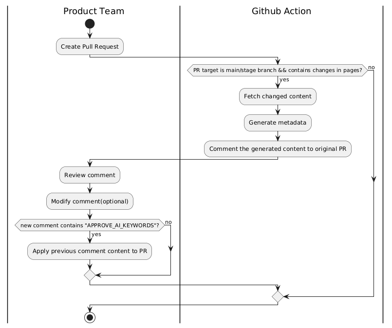
- Workflow UML for development  
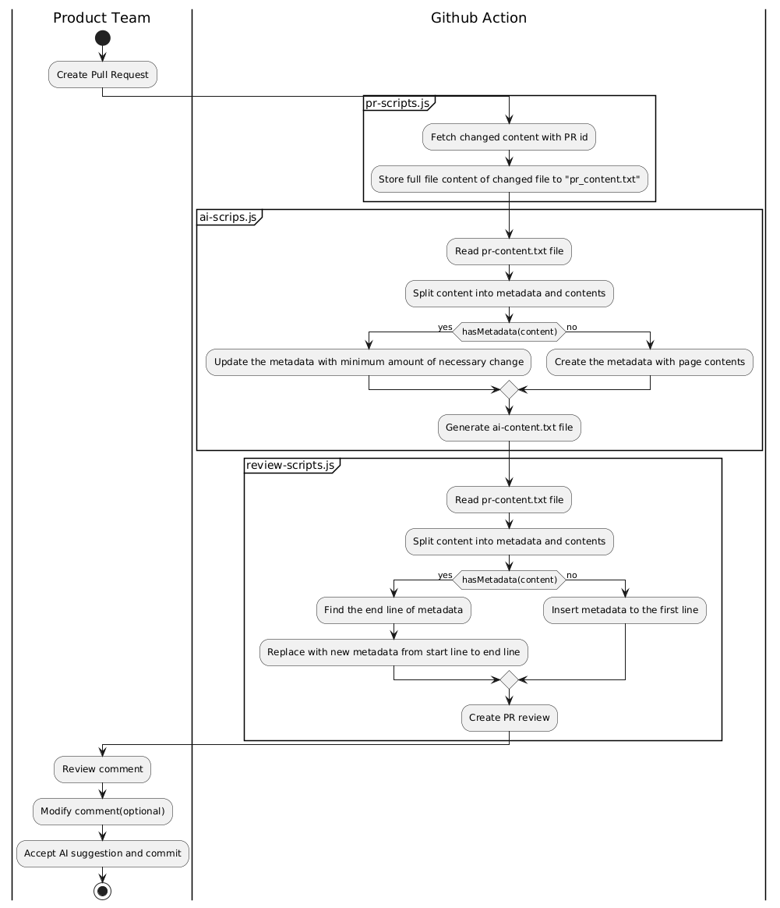

#### Project 2: Setup metadata for all pages with PR
- Workflow UML for demo  
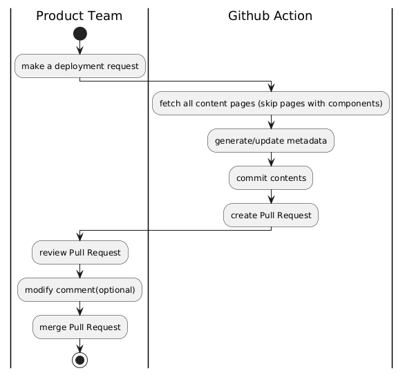
- Workflow UML for development  
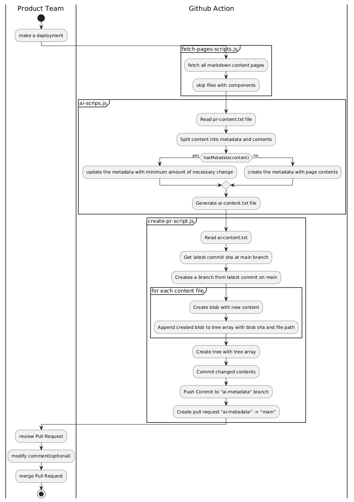

## Instruction
### Generate OPEN AI Credentials
1. Log in [Azure Portal](https://portal.azure.com/#@adobe.onmicrosoft.com/resource/subscriptions/144eeab3-93ab-462c-9ed5-8ba04c159339/resourceGroups/ioevents-nonprod/providers/Microsoft.CognitiveServices/accounts/ioevents-openai-test/overview) with Adobe account
2. Click "Explore azure AI foundry portal"
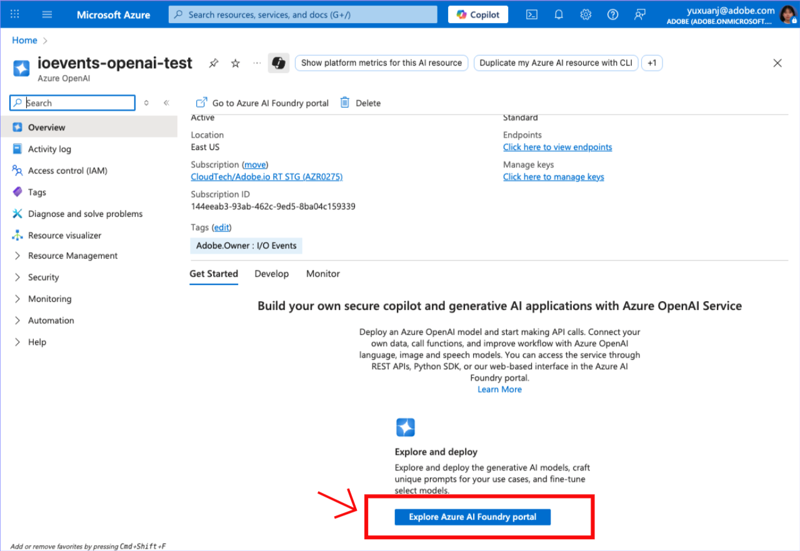
3. Click "Create new deployment" -> "From base models"
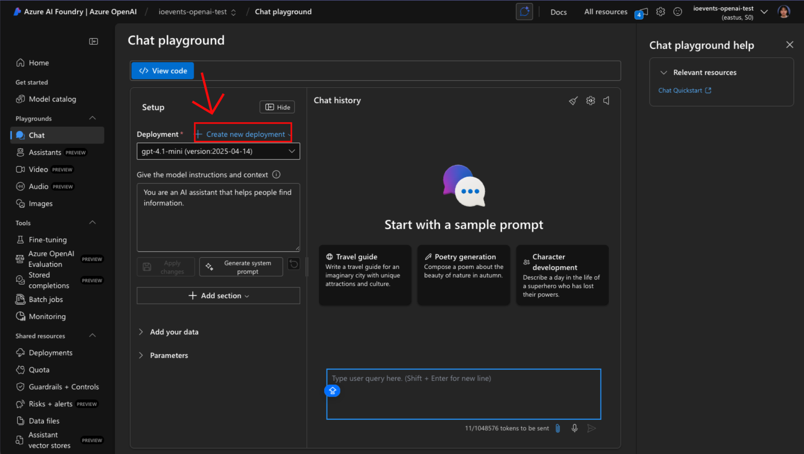
4. Select a model (recomment gpt4.1)
5. Click "Confirm"
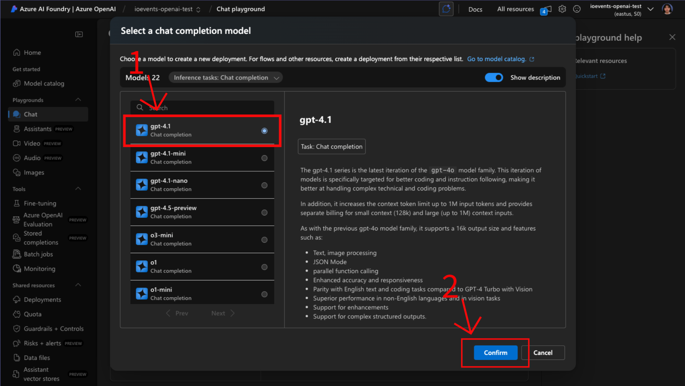
6. Edit the Deployment Name and Deploy
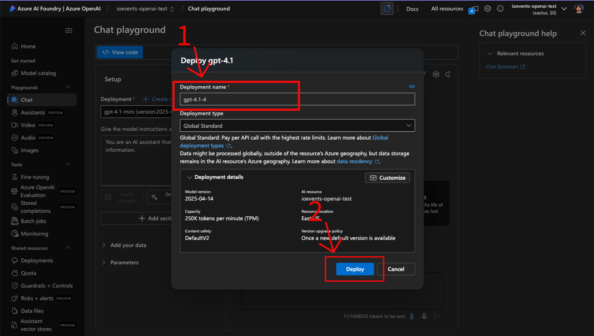
7. Click "View code"
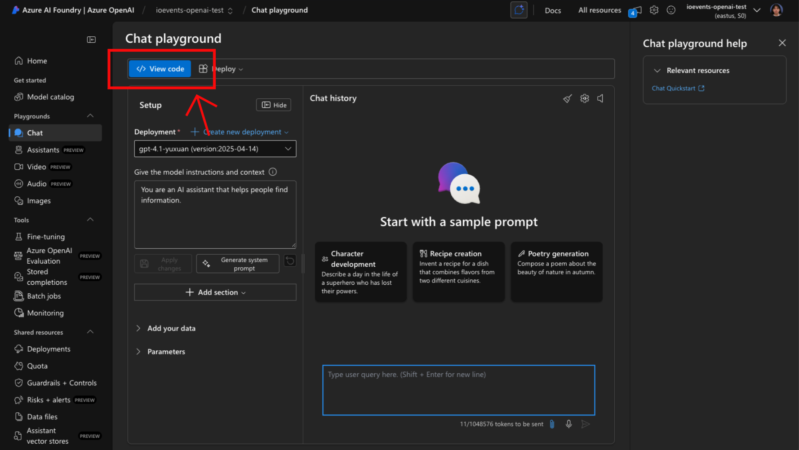
8. Select "Key authentication"
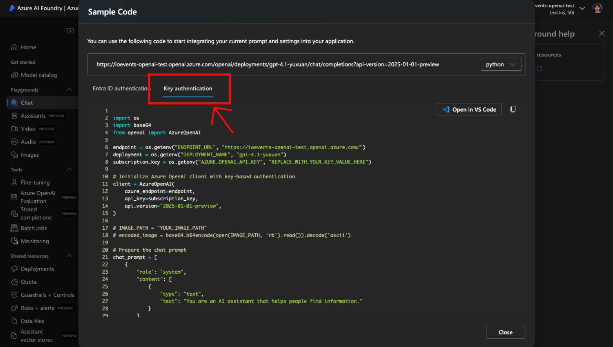
9. Scroll down, then copy endpoint and api key at the bottom
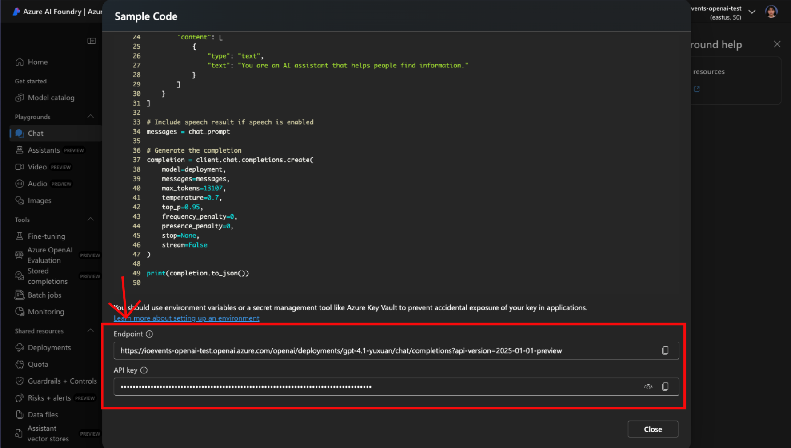
10. To run the program on local machine, run `export export AZURE_OPENAI_ENDPOINT="<replace with you azure endpoint>"` and `export export AZURE_OPENAI_API_KEY="<replace with you azure API key>"`

### Generate Github Token for API
1. Click Github Avator at the right corner
2. Click "Settings"
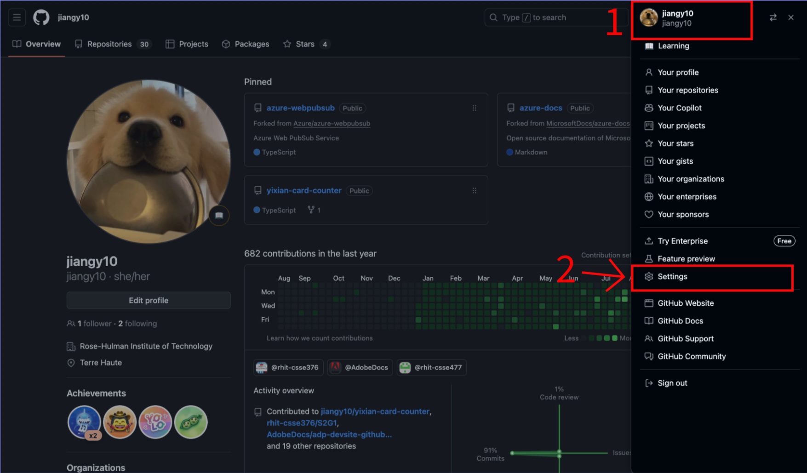
3. Click "Developer Settings"
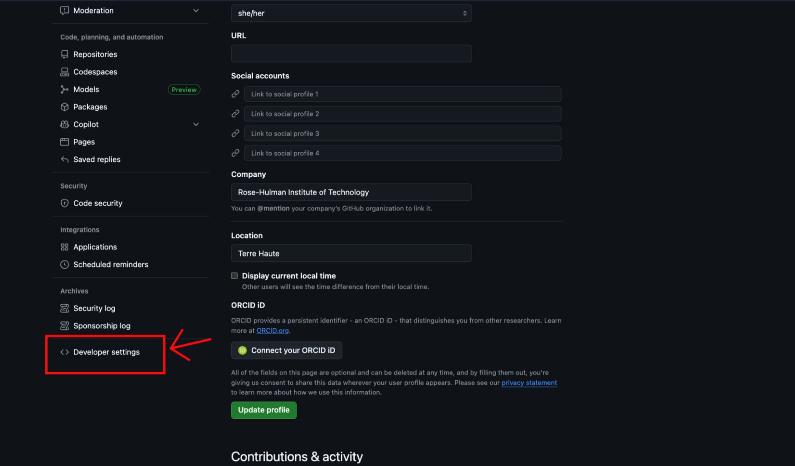
4. Click "personal Access Tokens" -> "Tokens(classic)" -> "Generate new token"
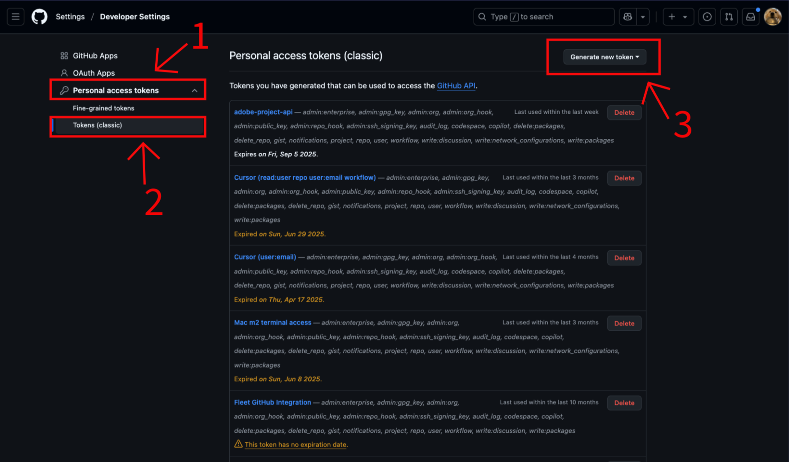
5. To run the program on local machine, run `export GITHUB_TOKEN="<replace with your token>"`
> 💡Note: Github Token is only used for Github API call in local development. Without an github token in REST API header, Github will limit the read access for 60 requests/hour, and no edit aceess allowed.

### Store Scretes in Git Repo
1. Go to target git repo
2. Click "Settings" -> "Secretes amd variables" -> "Actions"
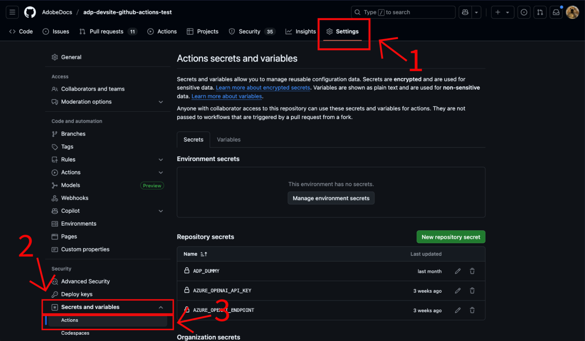
3. Click "New Repository Secrete" to add secreates / Click one Secreate's name to overwrite secreate
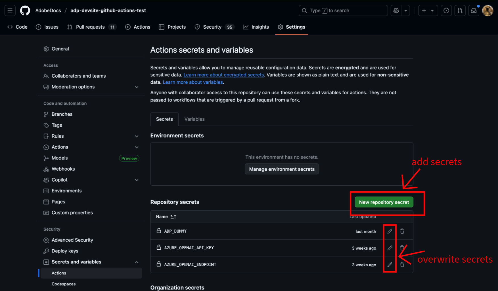

