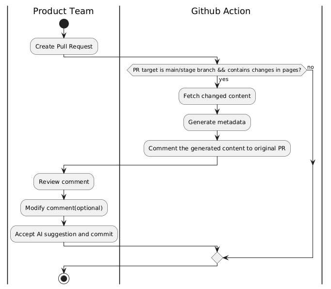

## Introduction 🛎️
### Workflow
#### Project 1: Pull Request Suggestion
- Workflow UML for demo  

- Workflow UML for development  

#### Project 2: Setup metadata for all pages with PR
- Workflow UML for demo  

- Workflow UML for development  

## Instruction 📐
### Generate OPEN AI Credentials
1. Log in [Azure Portal](https://portal.azure.com/#@adobe.onmicrosoft.com/resource/subscriptions/144eeab3-93ab-462c-9ed5-8ba04c159339/resourceGroups/ioevents-nonprod/providers/Microsoft.CognitiveServices/accounts/ioevents-openai-test/overview) with Adobe account
2. Click "Explore azure AI foundry portal"

3. Click "Create new deployment" -> "From base models"

4. Select a model (recomment gpt4.1, but we can try gpt5 as well 🤩)
5. Click "Confirm"

6. Edit the Deployment Name and Deploy

7. Click "View code"

8. Select "Key authentication"

9. Scroll down, then copy endpoint and api key at the bottom

10. To run the program on local machine, run `export export AZURE_OPENAI_ENDPOINT="<replace with you azure endpoint>"` and `export export AZURE_OPENAI_API_KEY="<replace with you azure API key>"`

### Generate Github Token for API (local dev only)
1. Click Github Avator at the right corner
2. Click "Settings"

3. Click "Developer Settings"

4. Click "personal Access Tokens" -> "Tokens(classic)" -> "Generate new token"

5. Grant at least read and write access to the token
6. To run the program on local machine, run `export GITHUB_TOKEN="<replace with your token>"`
> 💡Note: Github Token is only used for Github API call in local development. Without an github token in REST API header, Github will limit the read access for 60 requests/hour, and no edit aceess allowed.

### Store Scretes in Git Repo
1. Go to target git repo
2. Click "Settings" -> "Secretes amd variables" -> "Actions"

3. Click "New Repository Secrete" to add secreates / Click one Secreate's name to overwrite secreate

## Run the Program 💻
### Local Environment
#### PR suggestion
1. Set up the local environment:
    - Github Token: run `export GITHUB_TOKEN="<replace with your token>"`
    - Azure Open AI endpoint: run `export export AZURE_OPENAI_ENDPOINT="<replace with you azure endpoint>"`
    - Azure Open AI API key: run `export export AZURE_OPENAI_API_KEY="<replace with you azure API key>"`
    - File Path: run `export FILE_NAME="all_pages_content.txt"` (this is because both workflow shares ai-scripts.js, so need to differentiate file name to avoid duplication of code)
2. Download dependencies
    - run `npm install`, or `yarn install` if npm doesn't work
3. Run scripts one by one following deploy.yml
    - run `node src/pr-scripts.js`
    - run `node src/ai-scripts.js`
    - run `node src/review-scripts.js`
4. Checkout the target Pull Request, the AI suggestion should be there

#### AI metadata for all pages
1. Set up the local environment:
    - Github Token: run `export GITHUB_TOKEN="<replace with your token>"`
    - Azure Open AI endpoint: run `export export AZURE_OPENAI_ENDPOINT="<replace with you azure endpoint>"`
    - Azure Open AI API key: run `export export AZURE_OPENAI_API_KEY="<replace with you azure API key>"`
    -  Pull Request id: run `export PR_ID="<replace with pr id>"`
    - File Path: run `export FILE_NAME="pr_content.txt"` (this is because both workflow shares ai-scripts.js, so need to differentiate file name to avoid duplication of code)
2. Download dependencies
    - run `npm install`, or `yarn install` if npm doesn't work
3. Run scripts one by one following test/pull-request.yml
    - run `node src/fetch-pages-scripts.js`
    - run `node src/ai-scripts.js`
    - run `node src/create-pr-scripts.js`
4. Checkout the git repo, the new created PR should be opened

### Github Action
#### PR suggestion
1. Set up secretes in github repo
    - AZURE_OPENAI_ENDPOINT
    - Azure_OPENAI_API_KEY
    - (no need for github token, github action will provide one for itself)
2. Create a pull request targeting to main branch with markdown changes in src/pages
3. To run the program again, just close and repoen the pull request

#### AI metadata for all pages
1. Set up secretes in github rep
    - AZURE_OPENAI_ENDPOINT
    - Azure_OPENAI_API_KEY
    - (no need for github token, github action will provide one for itself)
2. deploy the main branch in github action

## Further Development Note ✏️
- The markdown files with components are skipped for now, need to update them if we find a way to get raw information inside the components/ There's some special case for component detection, we can't skip a non coponent tag like 
. 
- The github repo related variables (owner, repo, ref ...) are hard coded, need to be updated for production
- The PR suggestion workflow is defined in test-pull-request.yml, and the AI metadata for all pages is defined in deploy.yml. They may need to be seperated. 
- AI metadata for all pages workflow will create a PR targeting to main branch, which will trigger pr suggestion workflow. Pr suggestion may not appear everytime since the AI prompt requested "minimum amount of necessary change", we may need to refine the prompt to fix it? Another way is to add another condition to PR suggestion: "if the PR is created by github bot, then skip this workflow".
- The ai-scripts.js is using templates of fixed 5 key words in prompt, may need to update a flexible amount account to the page content.
- Need a stable Azure Open AI endpoint.

> For any other questions, please feel free to reach out to the corn field 🌽  
[School Email](jiangy10@rose-hulman.edu): actively checking before Nov 2025  (if no response in 2 hours, either in exam 📝 or in game raid 🎮)  
[Personal Email](jiang17832@gmail.com): checking daily
