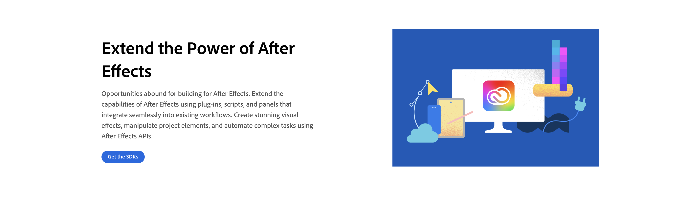
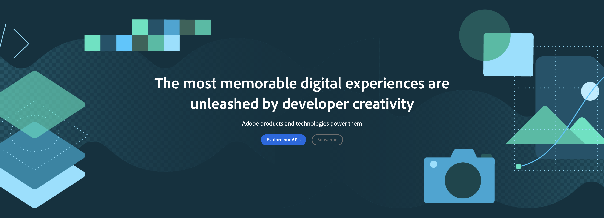

### Superhero Block

A Superhero Block should be used on every home page. **Only 1 Hero Block per page is allowed**.
They are used to set up the tone of the page and optionally add call to actions and intentions for users.

There are 4 different variants:

- The default variant for Documentation pages.
- The half width variant for Product/Platform authored pages.
- The centered variant for Index home pages.
- The centered XL variant for Index home pages.

**Default variant:**


```
<Superhero slots="image, heading, text, buttons" background="rgb(22, 49, 42)"/>


# Adobe Photoshop and Lightroom API

Unlock the potential of Photoshop, Lightroom, and cutting edge Sensei services through an easy-to-use RESTful API.

* [Get the SDKs](https://developer.adobe.com/console/servicesandapis/ae)
```

Use `slots` to identify the markdown content:

- `heading` (required)
- `text` (required)
- `image` (optional)
- `buttons`(optional) 

Use `background` to set a custom background color matching your color scheme. Defaults to `rgb(29, 125, 238)`.

Use `textColor` to customize text color. Available options include white, black, navy, and gray. Defaults to white.

**Half width variant**



```
<Superhero slots="image, heading, text, buttons" variant="halfWidth" />


# Extend the Power of After Effects

Opportunities abound for building for After Effects. Extend the capabilities of After Effects using plug-ins, scripts, and panels that integrate seamlessly into existing workflows. Create stunning visual effects, manipulate project elements, and automate complex tasks using After Effects APIs.

* [Get the SDKs](https://developer.adobe.com/console/servicesandapis/ae)
```

Use `variant="halfWidth"` to set the half width variant.

Use `slots` to identify the markdown content:

- `heading` (required)
- `text` (required)
- `image` or `video` (required)
- `fullWidthBackground` (optional)
- `buttons` (optional)

Use `background` to set a custom background color matching your color scheme. Defaults to `rgb(255, 255, 255)`.

Use `textColor` to customize text color. Available options include white, black, navy, and gray. Defaults to black.

Use `overGradient` to improve button visibility against gradient backgrounds.

**Centered variant**


```
<Superhero slots="image, heading, text, buttons" variant="centered" />


# The most memorable digital experiences are unleashed by developer creativity

Adobe products and technologies power them

* [Explore our APIs](https://adobe.io)
* [Subscribe](https://adobe.io)
```

Use `variant="centered"` to set the centered variant.

Use `slots` to identify the markdown content:

- `heading` (required)
- `text` (required)
- `image` (optional)
- `buttons` (optional)

Use `background` to set a custom background color matching your color scheme. Defaults to `rgb(29, 125, 238)`.

Use `textColor` to customize text color. Available options include white, black, navy, and gray. Defaults to white.

**Centered XL variant**



```
<Superhero slots="image, heading, text, buttons" variant="centeredXL" />


# The most memorable digital experiences are unleashed by developer creativity

Adobe products and technologies power them

* [Explore our APIs](https://adobe.io)
* [Subscribe](https://adobe.io)
```

Use `variant="centeredXL"` to set the centered XL variant.

Use `slots` to identify the markdown content:

- `heading` (required)
- `text` (required)
- `image` (optional)
- `buttons` (optional)

Use `background` to set a custom background color matching your color scheme. Defaults to `rgb(29, 125, 238)`.

Use `textColor` to customize text color. Available options include white, black, navy, and gray. Defaults to white.
