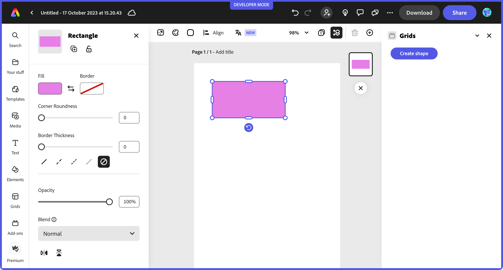
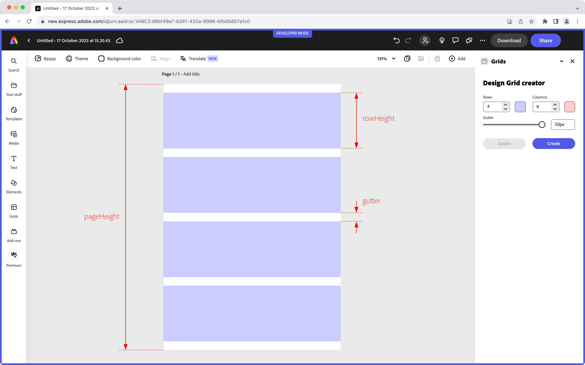

---
keywords:
    - Adobe Express
    - Express Add-on SDK
    - Express Document API
    - Document Model Sandbox
    - Adobe Express
    - Add-on SDK
    - SDK
    - JavaScript
    - Extend
    - Extensibility
    - API
title: Building your first add-on with the Document API
description: This is an in-depth tutorial that will guide you in the creation of a Grids add-on for Adobe Express using the Document API
contributors:
    - https://github.com/undavide
---

# Building your first add-on with the Document API

This tutorial will guide you through the creation of your first Adobe Express add-on based on the Adobe Express Document API.

## Introduction

Hello, and welcome to this Adobe Express Document API tutorial, where we'll build together a **fully functional Grid System add-on** from scratch. Grid systems are widely used in the design world to bring structure and consistency to all visual content, from flyers to web pages or social media posts.

<Media slots="video"/>

<https://www.youtube.com/watch?v=SQMYA660gII>


Your add-on will allow users to create a variable number of rows and columns, control the spacing between them (known as the _gutter_), and apply color overlays.

### Changelog

This tutorial has been written by [Davide Barranca](https://www.davidebarranca.com), software developer and author from Italy; revision history as follows.

**January 9th, 2024**

-   Added additional information on the project's setup.
-   Renamed `createStroke()` to `makeStroke()`: according to the new naming convention, `make*` is used for plain objects and helper utilities, whereas `create*` is reserved to live document objects, e.g., `createEllipse()`.
-   Improved explanations for importing Spectrum Web Components.

**December 3rd, 2023**

-   Removed the experimental warning from the document model sandbox APIs.
-   Importing `colorUtils` instead of `utils` from `"express-document-sdk"`; the built-in `colorUtils.fromHex()` method replaces the custom `hexToColor()`.
-   In the new API, nodes don't have the `fills` property (and it's `append()` method) anymore; instead, they use `fill`, to which a `ColorFill` is assigned.

**November 29th, 2023**

-   `apiProxy()` now accepts `"documentSandbox"` as a parameter, instead of `"script"`.
-   `manifest.json` now accepts `"documentSandbox"` in lieu of the `"script"` property for the document sandbox entry point. This requires the `"@adobe/ccweb-add-on-scripts"` dependency to be updated to version `"^1.1.0"` or newer in the `package.json` file.
-   `addOnSandboxSdk` is now imported from `"add-on-sdk-document-sandbox"` (it used to be `"AddOnScriptSdk"`).
-   `editor` and other modules are now imported from `"express-document-sdk"` (it used to be `"express"`).
-   The `webpack.config.js` file has been updated to reflect the new imports (see the `externals` object) in both the `express-grids-addon` and `express-addon-document-api-template` projects.
-   `Constants` are now `constants` (lowercase), and their enumerations have changed (e.g., `BlendModeValue` is now `BlendMode`).
-   `translateX` and `translateY` have conflated in the new `translation` property.
-   The group's warning about the operations order (create, append, fill) has been removed; groups can now be created, filled and appended.

**November 21st, 2023**

-   Editor API are now called the Document API, which are part of the Document Model Sandbox.
-   Update the add-on folders to reflect the new naming convention (`script` is now `documentSandbox`).
-   Update Reference Documentation links and screenshots.

**November 6th, 2023**

-   First publication.

### Prerequisites

-   Familiarity with HTML, CSS, JavaScript.
-   Familiarity with the Adobe Express add-ons environment; if you need a refresher, follow the [quickstart](/guides/getting_started/quickstart.md) guide.
-   An Adobe Express account; use your existing Adobe ID or create one for free.
-   Node.js version 16 or newer.

### Topics Covered

### Getting Started with the Document API

As part of the [Document Model Sandbox](/references/document-sandbox/index.md), the Adobe Express Document API (from now on, Document API) is a powerful tool that extends the capabilities of Adobe Express add-ons, offering direct interaction with the open document. Let's take a moment to review the difference between the two core components of the architecture of an add-on.

-   The **iframe** hosts the add-on User Interface and runs its internal logic. You can think about it as a web application operating in a sandboxed environment: it needs to be separate from the rest of the Adobe Express content for security reasons, which is precisely why the add-on is hosted within an `<iframe>` element (a detailed technical description is found [here](/guides/develop/context.md#iframe-sandbox)). If you come from a CEP/UXP background, it's akin to developing the panel of an extension or plugin.
-   The **Document Model Sandbox**: allows you to operate on the document. It's a sandboxed JavaScript environment that communicates with the iframe (thanks to the [Communication API](/references/document-sandbox/communication/)), providing access to the [Document API](/references/document-sandbox/document-apis/). Drawing the parallel with CEP and UXP again, it represents scripting; that is, the possibility to drive Adobe Express programmatically and, for example, add pages or artboards, create new shapes, rotate or group them, etc.

This is a high-level overview of the overall structure; while the implementation has more technical nuances, there's no need to dive deeper now.


### The Project Structure

The complete code for the Grids System add-on can be found [here](https://github.com/AdobeDocs/express-add-on-samples/tree/main/document-sandbox-samples/express-grids-addon/): it is provided as a [complete project](https://github.com/AdobeDocs/express-add-on-samples/tree/main/document-sandbox-samples/express-grids-addon/grids-design-end), although it would be best if you followed along from [this starting point](https://github.com/AdobeDocs/express-add-on-samples/tree/main/document-sandbox-samples/express-grids-addon/grids-design-start), which sets up a JavaScript/Webpack environment with everything needed.[^1]

You can either clone the entire repository:

```bash
git clone https://github.com/AdobeDocs/express-add-on-samples.git
```

<!-- code here -->
<InlineAlert variant="info" slots="text1" />

Strokes are created with the `editor.makeStroke()` method, which accepts more parameters (all optional). It's documented [here](/references/document-sandbox/document-apis/classes/Editor.md#makestroke).

The `rect` object now exists as a `RectangleNode` instance with a width of 200 pixels, a height of 100, the top-left corner at the coordinate (50, 50) and a pastel pink fill color. But **it still needs to be rendered on the page!**

```js
// appending the rect object to the scene
editor.context.insertionParent.children.append(rect);
```

Let's unpack this line. As it usually happens with any DOM (Document Object Model), it's easier if read _backwards_—from the end to the beginning. We are appending the `rect` object to the `children` list of the `insertionParent` (which is "the _preferred parent_ to insert newly added content into") of the `context` (the "User's current selection context"), a property of the `editor` class.[^2]

In other words, we're adding `rect` as a sibling of whatever happens to be active at the moment: this is what the `context.insertionParent.children` dance does. If you try to add `rect` while a shape nested inside a group is selected, then `rect` will also belong to that group. Please note that Adobe Express documents are based on data structures where instances are _appended_ to collections: you `append()` a rectangle to a container's `children` collection.[^3]



Alternatively, you can target the insertion point specifically rather than relying on what happens to be selected at the time of execution. For instance, the following code uses the first [Artboard](/references/document-sandbox/document-apis/classes/ArtboardNode/) of the first [Page](/references/document-sandbox/document-apis/classes/PageNode/).

```js
// ...
const doc = editor.documentRoot; // document
const currentPage = doc.pages.first; // page
const currentArtboard = currentPage.artboards.first; // artboard
currentArtboard.children.append(rect); // children
// or
editor.documentRoot.pages.first.artboards.first.children.append(rect);
```

Quoting a revealing bit of the Page reference:

> A PageNode represents a page in the document. A page contains one or more artboards, representing "scenes" in a linear timeline sequence. Those artboards, in turn, contain all the visual content of the document.

You now understand the fundamentals of the Adobe Express DOM and the hierarchical relations between nodes. You have all the necessary tools to begin coding the Grids add-on; you can always refer to the documentation when needed.

## Coding the Grids add-on

### Designing the UI with Spectrum Web Components

Although the main subject of this tutorial is the Document API, let's spend a moment discussing the Grid add-on's User Interface. It's built mainly with **Spectrum Web Components** (see [this guide](/guides/design/user_interface.md) for a refresher on Adobe's UX Guidelines and the use of the Spectrum Design System), in particular:


```text
rowHeight = (pageHeight - (rowsNumber + 1) * gutter) / rowsNumber;
```

This is because we're using gutters as page margins, too, as the following illustration shows.



We must get hold of the [Document](/references/document-sandbox/document-apis/classes/Editor.md#documentroot) (as `documentRoot`, from the Editor class) and [Page](/references/document-sandbox/document-apis/classes/PageNode/)—the first one from the `pages` list will be OK for our purposes. Page properties like `width` and `height` will be used to compute the attributes of each "row" Rectangle.

```js
// ...
runtime.exposeApi({
    addGrid({ columns, rows, gutter, columnColor, rowColor }) {
        const doc = editor.documentRoot;
        const page = doc.pages.first;
        const rowWidth = page.width;
        const rowHeight = (page.height - (rowsNumber + 1) * gutter) / rowsNumber;
    },
});
```
