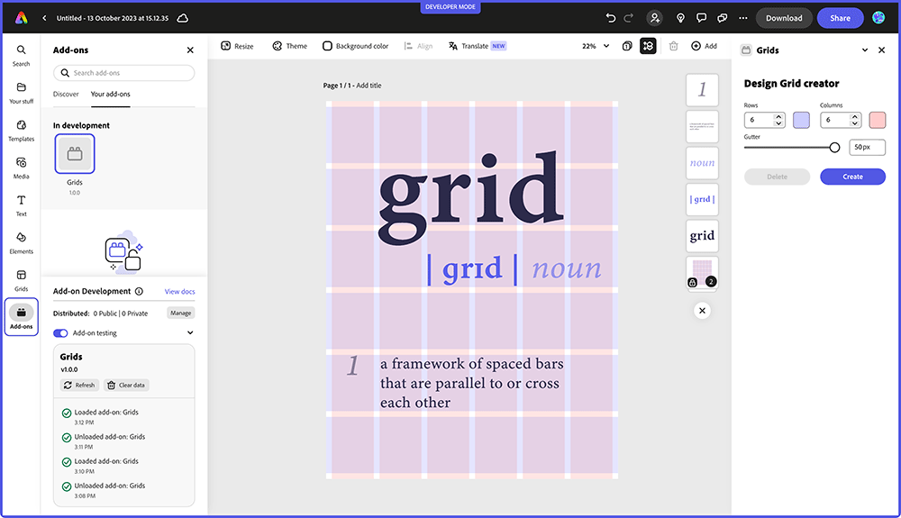
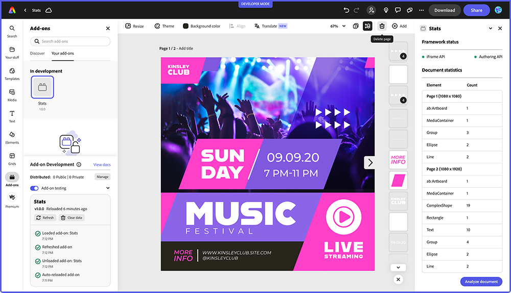

<HeroSimple slots="heading, text" />

## Build add-ons for Adobe Express

Expand the capabilities of the quick and easy create-anything app. Empower the global creative community with solutions for millions of users.

## API endpoints

Adobe I/O Runtime supports the following API endpoints for interacting programmatically with the service. 

**Notes:**

1. Unless otherwise noted, all parameters are required. 
2. For all the API calls on this page, the base URL is:  
   `https://api.adobe.io/`

<Announcement slots="heading, text, button" variant="secondary" />

### Are you an existing developer?

Action required: Add trader details to continue EU distribution.

- [Add trader details now.](https://new.express.adobe.com/add-ons?mode=submission)

<Announcement slots="heading, text, button" variant="secondary" backgroundColor = "background-color-navy" />

### Are you an existing developer?

Action required: Add trader details to continue EU distribution.

- [Add trader details now.](https://new.express.adobe.com/add-ons?mode=submission)

<Announcement slots="heading, text, button" variant="secondary"/>

### Are you an existing developer?

Action required: Add trader details to continue EU distribution.

- [Add trader details now.](https://new.express.adobe.com/add-ons?mode=submission)

<Announcement slots="heading, text, button"/>

### Are you an existing developer?

Action required: Add trader details to continue EU distribution.

- [Add trader details now.](https://new.express.adobe.com/add-ons?mode=submission)

<Product-Card slots="icon,  heading , text, buttons" theme="light" repeat="2" />

## Product 1

Lit is a simple library for building fast, lightweight web components. It's built on top of the Web Components standard and provides a set of tools and utilities to simplify the creation of custom elements. Lit uses modern web standards like JavaScript template literals and reactive properties to create reusable and efficient components with minimal boilerplate required.

[Learn more](https://lit.dev/)
[View Docs](https://lit.dev/)

## Product 2

TypeScript is a statically typed superset of JavaScript that adds optional static types to the language.TypeScript aims to improve the development experience by providing a robust type system, which helps catch errors early during development and enhances code quality and maintainability.

[Learn more](https://https://www.typescriptlang.org/)
[View Docs](https://lit.dev/)

<Info-Card slots="link, image, heading, text" repeat="2"/>

[Express Document API](grids-addon.md)

### Creating a Grid System add-on with the Adobe Express Document API

Davide Barranca - November 6th, 2023

[Coming Soon...](stats-addon.md)

### Creating a Stats add-on with the Adobe Express Communication API

Davide Barranca - December 14th, 2023

### GET /runtime/admin/namespaces/{orgId}/{intId}

Returns the details of the namespace associated with the specified organization and integration.

#### _Parameters:_

| Name                                 | Description                                     |
| ------------------------------------ | ----------------------------------------------- |
| `orgId` (`string`: _path_)           | Organization ID                                 |
| `intId` (`string`: _path_)           | Integration ID                                  |
| `Authorization` (`string`: _header_) | Authorization token in format: `Bearer {token}` |
| `X-Api-Key` (`string`: _header_)     | Api key                                         |

#### _Responses:_

Response content type: `application/json`
| Code | Description                        |
| ---- | ---------------------------------- |
| 200  | Successful operation Example value |

<Product-Card slots="icon, heading , text, buttons" theme="light" />

### Product 1

Lit is a simple library for building fast, lightweight web components. It's built on top of the Web Components standard and provides a set of tools and utilities to simplify the creation of custom elements. Lit uses modern web standards like JavaScript template literals and reactive properties to create reusable and efficient components with minimal boilerplate required.

[Learn more](https://lit.dev/)
