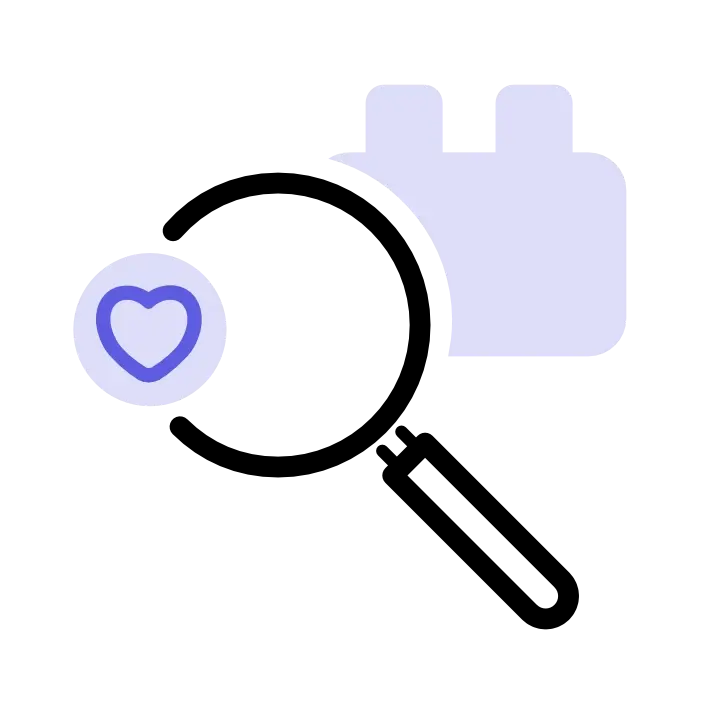

<HeroSimple slots="image, heading, text , buttons" variant="fullWidth" textColor="white" />

## Build add-ons for Adobe Express

Expand the capabilities of the quick and easy create-anything app. Empower the global creative community with solutions for millions of users.

[Explore our APIs](https://adobe.io)
[Learn more](https://adobe.io)

<Columns slots="image, heading, text, links" variant="vertical" repeat ="2" />

### Discover

Explore how add-ons can expand capabilities and streamline creative workflows.

- [Find inspiration →](https://www.microsoft.com/microsoft-365/microsoft-teams/group-chat-software)

### Learn

Familiarize and experiment with powerful features in our Code Playground.

- [Dive deeper →](https://www.atlassian.com/enterprise/cloud)

<Announcement slots="heading, text, button" backgroundColor = "background-color-gray" />

### Are you an existing developer?

Action required: Add trader details to continue EU distribution.

- [Add trader details now.](https://new.express.adobe.com/add-ons?mode=submission)

<Announcement slots="heading, text, button" variant="secondary" backgroundColor = "background-color-dark-gray" />

### Are you an existing developer?

Action required: Add trader details to continue EU distribution.

- [Add trader details now.](https://new.express.adobe.com/add-ons?mode=submission)

<Columns slots="image, heading, text, buttons" repeat ="3" />

### Heading 3 is the size with bold

Normal text in here and you can write about two paragraphs worth. This is just filler to keep going on and on and on. Taking up space to make it look like this is actually about something.

[Adobe Photoshop](https://www.microsoft.com/microsoft-365/microsoft-teams/group-chat-software)

### Fast custom app design

Build custom apps that interact with core Adobe services, and automate processes with event-based integrations. Access authentication services, end-user access controls, the ability to publish/consume custom events, data storage, CI/CD pipelines.

[Dive deeper](https://www.atlassian.com/enterprise/cloud)

### Heading 3 is the size with bold

Normal text in here and you can write about two paragraphs worth. This is just filler to keep going on and on and on. Taking up space to make it look like this is actually about something.

[Adobe Photoshop](https://www.microsoft.com/microsoft-365/microsoft-teams/group-chat-software)
