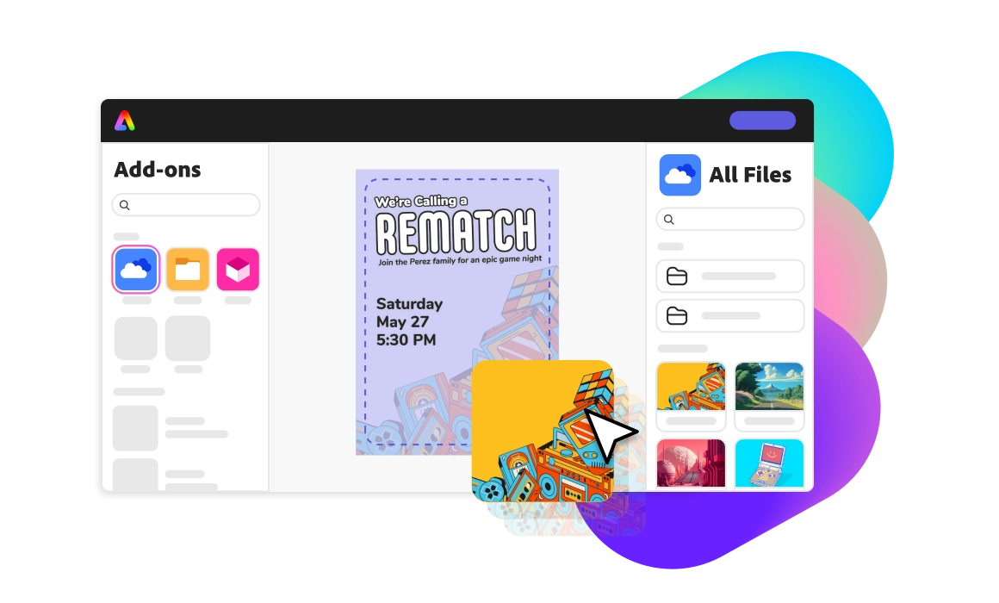

<HeroSimple slots="image, heading, text" background="green"/>

## Build add-ons for Adobe Express

Expand the capabilities of the quick and easy create-anything app. Empower the global creative community with solutions for millions of users.

## Class: Editor new4

Entry point for APIs that read or modify the document's content.

## Accessors

### context

• `get` **context**(): [`Context`](context.md)

User's current selection context

#### Returns

[`Context`](context.md)

<HorizontalLine />

User's express root node

## documentRoot

• `get` **documentRoot**(): [`ExpressRootNode`](express-root-node.md)

<Product-Card slots="icon,text, buttons" repeat="2" theme="light" />

Lit is a simple library for building fast, lightweight web components. It's built on top of the Web Components standard and provides a set of tools and utilities to simplify the creation of custom elements. Lit uses modern web standards like JavaScript template literals and reactive properties to create reusable and efficient components with minimal boilerplate required.

[Learn more](https://lit.dev/)

TypeScript is a statically typed superset of JavaScript that adds optional static types to the language.TypeScript aims to improve the development experience by providing a robust type system, which helps catch errors early during development and enhances code quality and maintainability.

[Learn more](https://https://www.typescriptlang.org/)
